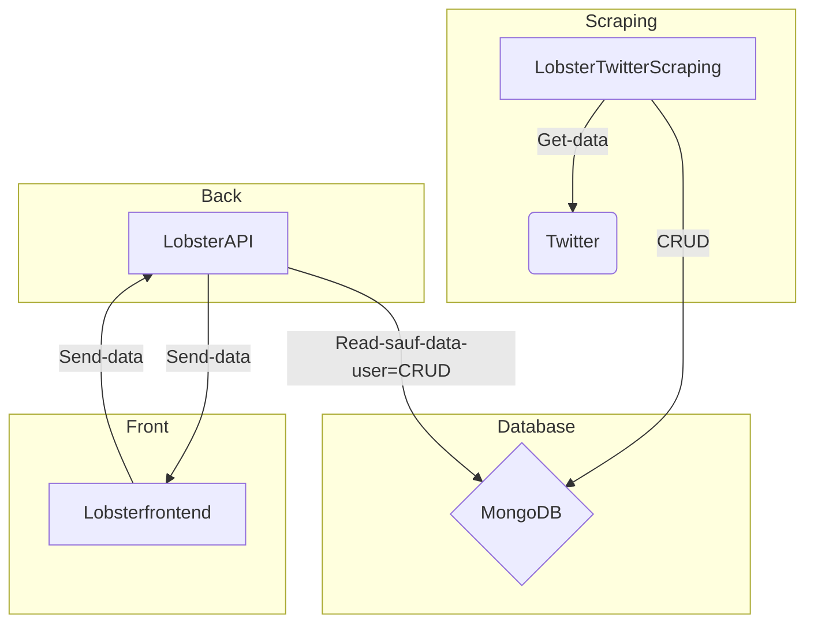

# LobsterAPI


## But du projet

**Statut** : développement en cours depuis mai 2022.


### Description des fonctionnalités / pages
LOBSTER est un site internet avec 1 page d'accueil où nous avons 1 dashboard composé de plusieurs graphes :
* 1 Graphe principal qui est le graphe le plus important du site. Il s'agit de la cartographie des acteurs importants concernant 1 mot donné (par exemple "hydrogène"), nous aurions donc "Air Liquide", etc. avec leurs couleurs (ce qu'ils en pensent -> en l'occurrence ils sont pour) et les liaisons entre ces acteurs : clusters d'acteurs/groupes.
* Plusieurs autres graphes : il y aura d'autres analyses du mot choisi (nous ferons le choix de tel ou tel graphe en fonction de ce qui est intéressant à analyser. On choisira par exemple un chart pie pour représenter une part de marché plutôt qu'un chart line -> ça ne serait pas cohérent).
* Enfin, des recherches sur le mot choisi sur le graphe en lui-même est éventuellement possible, à creuser via notre module Sigma.JS.


### ACHITECTURE DU PROJET LOBSTER



### Technologies
**Backend**
* Node.js
* MongoDB

**Frontend**
* React.js
* Simga.js & Graphology.js
* Chart.js

**Scrapping**
* Nitter.py
* Django.py


### Evolutions possibles
1. L'analyse sémantique des mots

****

## Equipe & rôles

Notre équipe est composée de 2 équipes :


**FORMATION EN ALTERNANCE**

1. **FELLAH Mohamed-Fouad** - M2 MIAGE FA
1. **BAN Régis** - M2 MIAGE FA
1. **DJEBBARA Kahina** - M2 MIAGE FA
1. **MARECAR Sarah** - M2 MIAGE FA
1. **RAKOTONIRINA Onitiana** - M2 MIAGE FA
1. **TANG François** - M2 MIAGE FA


## Documentation

L'ensemble de la documentation listée ci-dessous se trouve ici notamment la documentation pour installer le projet.


## Communication au sein de notre équipe

Utilisation du [serveur Discord PPD - M1 MIAGE](https://discord.gg/69Wfxqfgmh).

****

## Documentation

### Versions des modules

**Backend :**
```
"config": "^3.3.7",
"cookie-parser": "~1.4.4",
"cors": "^2.8.5",
"debug": "~2.6.9",
"ejs": "^3.1.8",
"express": "~4.16.1",
"helmet": "^5.1.0",
"helmet-csp": "^3.4.0",
"http-errors": "~1.6.3",
"mongoose": "^6.3.5",
"morgan": "~1.9.1",
"nodemon": "^2.0.16",
"ora": "^5.4.1"
```

**Frontend :**
```
"@material-ui/core": "^4.12.4",
"@react-sigma/core": "^2.0.2",
"@testing-library/jest-dom": "^5.11.4",
"@testing-library/react": "^11.1.0",
"@testing-library/user-event": "^12.1.10",
"axios": "^0.27.2",
"graphology": "^0.24.1",
"graphology-layout-forceatlas2": "^0.9.1",
"lodash": "^4.17.21",
"moment": "^2.29.3",
"react": "^17.0.2",
"react-dom": "^17.0.2",
"react-redux": "^7.2.2",
"react-router-dom": "^5.2.0",
"react-scripts": "4.0.3",
"react-sigma-v2": "^1.3.0",
"redux": "^4.2.0",
"redux-devtools-extension": "^2.13.8",
"redux-logger": "^3.0.6",
"redux-thunk": "^2.4.1",
"sigma": "^2.3.1",
"web-vitals": "^1.0.1"
```

### Prérequis

1. [Installer Git](https://git-scm.com/downloads)
1. [Installer NodeJS](https://nodejs.org/en/download/)
1. [Visual Studio Code](https://code.visualstudio.com/Download)
1. [Installer MongoDB](https://www.mongodb.com/try/download/community)
1. [Installer Docker](https://docs.docker.com/engine/install/)


### Lancement classique
* Il faut tout d'abord récupérer l'ensemble de notre code via un git clone de nos 5 projets [depuis notre organisation GitHub](https://github.com/LobsterOrganization) :

**LOBSTER API**
* **HTTPS** : https://github.com/LobsterOrganization/LobsterAPI.git
* **SSH** : git@github.com:LobsterOrganization/LobsterAPI.git 


**LOBSTER API V2**
* **HTTPS** : https://github.com/LobsterOrganization/LobsterAPIV2.git
* **SSH** : git@github.com:LobsterOrganization/LobsterAPIV2.git 

**LOBSTER FRONTEND**
* **HTTPS** : https://github.com/LobsterOrganization/lobsterfrontend.git 
* **SSH** : git@github.com:LobsterOrganization/lobsterfrontend.git 

**LOBSTER FRONTEND V2**
* **HTTPS** : https://github.com/LobsterOrganization/lobsterfrontend.git 
* **SSH** : git@github.com:LobsterOrganization/lobsterfrontend.git 

**LOBSTER TWITTER SCRAPPING**
* **HTTPS** : https://github.com/LobsterOrganization/LobsterTwitterScrapping.git 
* **SSH** : git@github.com:LobsterOrganization/LobsterTwitterScrapping.git 

__Note :__ La liste des opérations suivantes sont à répéter autant de fois qu'il y a de projets, c'est-à-dire le faire 3 fois à la racine des 3 projets.

* Ensuite, il faut installer les packages. Pour cela, il faut lancer cette commande qui installera tous les packages requis depuis le fichier *package.json* :
```
npm i
```
* Maintenant que c'est fait, il manque un dernier fichier *default.json*. Il contient toutes les informations de configuration du projet dont le mot de passe de la base MongoDB. C'est pour cela qu'il ne se trouve pas sur le git. Il faudra donc le recréer.

Il faut donc créer un répertoire *config* qui contient un seul fichier *default.json*. Il faudra ensuite copier ce code dans ce fichier en replaçant tous les *xxxx* par le nom, mot de passe et adresse du serveur MongoDB personnel :
```
{
  "Lobster-Project": {
    "server": {
      "host": "localhost",
      "port": "444"
    },
    "dbConfig": {
      "host": "localhost",
      "port": 5984,
      "dbName": "xxxx"
    }
  }
}
```

* Voilà, vous êtes prêt à lancer le server en tapant
```
npm start
```
* Puis à se rendre sur **https://localhost:3001/dashboard** depuis un navigateur.


### DockerFile

#### Lancement du projet
...

#### Quelques commandes utiles

Par rapport aux images :
```
# Images
docker images
docker image rm [ID images]
docker image prune (supprime toutes les images non utilisées)
```

Par rapport aux conteneurs :
```
# Containers
docker ps
docker ps -a (all)
docker stop [ID Container]
docker rm [ID Container]
```
